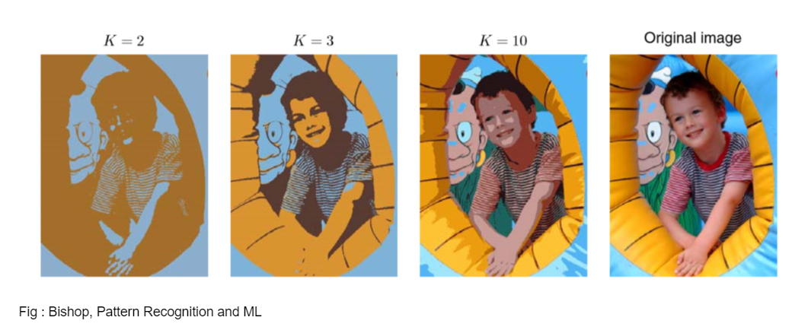

# K-Means
k-means clustering is a method of vector quantization, originally from signal processing, that aims to partition n observations into k clusters in which each observation belongs to the cluster with the nearest mean (cluster centers or cluster centroid), serving as a prototype of the cluster. This results in a partitioning of the data space into Voronoi cells. It is popular for cluster analysis in data mining. k-means clustering minimizes within-cluster variances (squared Euclidean distances), but not regular Euclidean distances, which would be the more difficult Weber problem: the mean optimizes squared errors, whereas only the geometric median minimizes Euclidean distances. For instance, better Euclidean solutions can be found using k-medians and k-medoids.

The problem is computationally difficult (NP-hard); however, efficient heuristic algorithms converge quickly to a local optimum. These are usually similar to the expectation-maximization algorithm for mixtures of Gaussian distributions via an iterative refinement approach employed by both k-means and Gaussian mixture modeling. They both use cluster centers to model the data; however, k-means clustering tends to find clusters of comparable spatial extent, while the expectation-maximization mechanism allows clusters to have different shapes.

The algorithm has a loose relationship to the k-nearest neighbor classifier, a popular machine learning technique for classification that is often confused with k-means due to the name. Applying the 1-nearest neighbor classifier to the cluster centers obtained by k-means classifies new data into the existing clusters. This is known as nearest centroid classifier or Rocchio algorithm.

## K-Means++

K-Means is quite sensitive to initalization, if the init is not good, our algorithm is not able to make desired number of clusters.
To overcome this problem, we use technique called K-Means++ described in paper [Robust Seed Selection for K-Means type of Algorithms](https://arxiv.org/abs/1202.1585) which chooses initial centers so that they are statiscallly close to final ones.

## DBSCAN

 * **Density Based Spatial Clustering of Applications with Noise**
 * Based upon on the idea, that a cluster is a high density area surrounded by low density region
 * Starts by exploring a small area, if density is "good enough" it considered as part of cluster, and explores neigbours and so on, so it groups regions based upon density!

# **Dominant Color Extraction for Image Segmentation**

  * **Image Segmentation**
  * Segmentation partitions an image into regions having similar visual appearance corresponding to parts of objects
  * We will try to extract the most dominant 'K' Colors using K-Means
  * We can apply K-Means with each pixel will reassigned to the closest of the K Colors, leading to segmentation
  
  
